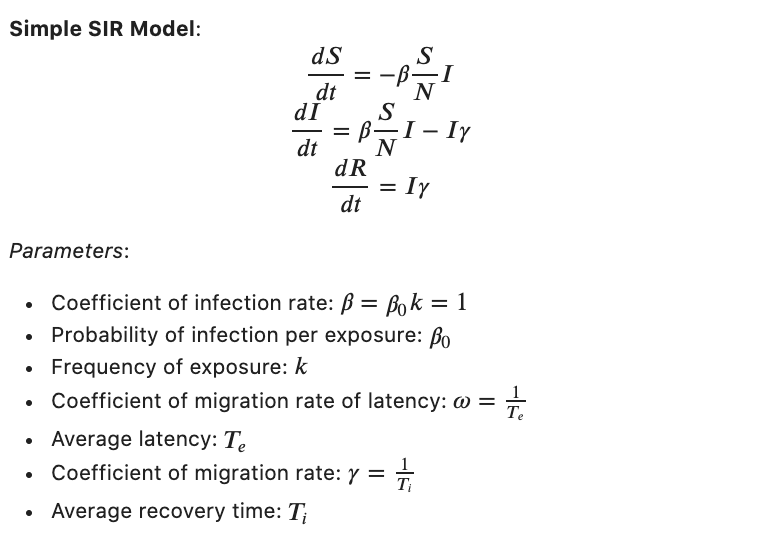

# Visualization of Different SIR Models with Optimized Parameter Sets to Predict the Transmission Dynamics of COVID-19 in Relation to Public Response to Government Policies. 
Author: Daniel Kim

***Abstract***: After two full months in effect, social distancing measures for COVID-19 have begun to relax across the United States. With each state differing on timelines and standards for reopening, it is important to quantify the effect preventive measures have had on disease containment, as well as modeling different reopening scenarios. This study explores the use of SIR, Cellular Automata, and Mixing-Domain models to represent disease dynamics using recent COVID-19 data. The results of this study show that following all of the different preventive measures available is necessary for fighting the spread of the disease. Choosing to adhere to some, such as wearing a mask but not others, such as staying at home, ultimately results in a net negative effect because the fraction of the population interacting with one another increases, which is the main driver for disease propagation.

## **1) Introduction** 

With the number of confirmed US cases and deaths reaching 2,000,000 and 123,000 as of June 11 (COVID-19 Map 2020), the impact of the current pandemic has been felt across the entire world. COVID-19 was officially declared a pandemic on March 11, 2020 (CDC 2020). Social distancing measures were implemented across the US in April to help curb the spread of the disease. As of June 2020, these measures have begun to relax in part due to economic reopening procedures in local governments as well as frustration from people. With numerous government policies that were enacted months ago still remaining, many individuals who initially were skeptical about stay at home orders have felt that these policies have become drawn out. A growing number of the population have begun to more freely leave their homes, believing that the worst days are behind us and the government projections are not to be trusted since they are far off from the current numbers. It is therefore crucial to understand the impact social distancing measures have had on containing disease propagation, as well as explore the effects of different variables upon these measures to better predict what lies ahead as the country begins to reopen.

Models for disease transmission come in three major forms: population-based, agent-based, and mesoscopic models. Population-based models divide the population into different compartments. Originally, the SIR system of differential equations does not include time-varying parameters or demographic dependencies. These have been shown to be crucial in representing disease dynamics. Agent-based models provide insight into the impact of government policies due to its visual approach. Lastly, mesoscopic models fall between the agent and population models. They build upon population models by subdividing compartments into separate demographics (i.e. age, employment, location, etc.), and specify domains where individuals congregate to more accurately represent the impact of interaction. 

In this study,  we use the three different model types to provide insight into COVID-19 social distancing numbers and modeling parameters. We first recapitulate the population-based SIR model from Yang, et al and expand upon the study by optimizing the parameters based on current COVID-19 data. We then use a Cellular Automata (CA) as an Agent-Based method to visualize the population based model and depict the effects of optimizing parameters. Lastly, we produce two mixing-domain models. Our first mixing-domain model assumes perfect mixing to represent what would occur if there was a lack of tests, contact tracing, and isolation of infected individuals. Our second mixing-domain model includes a time-delay parameter to show the outcomes based on if people immediately follow stay at home orders versus if people lag.

## **2) Methods & Results**

### 2.1 Optimizing SIR Model's Parameter Set to Match Ground Data
*Simple SIR*: This compartmental model divides the total population into susceptible, infected, and removed individuals. The SIR model is the most common and simple form. Several variations have been made to focus on the different aspects of transmission, but the standard model we implemented was the Simple SIR. Values for the optimized parameters were taken from Fang et al. from the Journal of Medical Virology. 

*Curve fitting for Parameter Optimization*: Once all the models were constructed, we performed parameter optimization to better represent and more accurately predict the transmission dynamics. The initial parameter values were estimated using interactive widgets (see code). Then, curve optimization of the simple SIR with these initial parameters was conducted via non-linear least squares fitting. Data was sourced from the COVID Tracking Project’s open source Github page (COVID Tracking Project 2020).  The resulting optimized parameters were β of 0.392 and γ of 0.0742. These correspond to an average recovery time T_i of 13.5 days and a basic reproductive number R_0 of 5.36. This parameter set was inputted into the SIR model and projected out from March 3 to May 1 to compare the optimized model to Michigan’s pre-quarantine data. 

Next, the outcome if no quarantine was enacted was projected for Michigan, assuming the same 9.5% fatality rate (calculated from the data’s deaths and confirmed cases). Michigan data was used since it had the highest fatality rate in the country as of May 1. Although the resulting value is skewed due to the lack of early testing, the projected number of fatalities was 94,000 and the peak number of infections was 4.9 million.

### 2.2 Cellular Automata Models to Visualize Disease Spread Dynamics   

*Cellular Automaton (CA)*: The probabilistic 2D Cellular Automaton model is based on the model from a study by Misici et al, with the addition of implementing a parameter for social distancing as well as a separate universe for interaction to simulate an essential retailer. The universes in this study are set as four separate 50x50 grids, each defined as a "city" with 2500 possible cells. In addition, a separate universe is constructed defining a public domain where people must go during social distancing, such as a grocery store. This public domain consists of a 5x5 grid with 25 cells to simulate a grocery store where individuals can stay apart in some areas and come into close proximity in others.
  
*Defining States*: There are four discrete states a cell can take.
1. C = 0 for a susceptible cell (Orange)
2. C = 1 for an empty cell (Black)
3. C = 2 for an infected cell (Red)
4. C = 3 for a removed cell (Green)

The amount of empty cells a universe has correlates to the strength of that universe's social distancing policies. Empty spaces are randomly distributed to simulate that of a city, where certain areas or neighborhoods better adhere to social distancing policies than others. Removed cells follow the standard SIR model where it assumes both immune and deceased individuals.
  
*Neighborhood*: This study utilizes a standard Moore Neighborhood of range 1. The Moore neighborhood equation is given by N = (2R + 1)^2
In this case, a range 1 denotes 9 neighbors for each cell. Wrap around boundary conditions are used to ensure each cell has 9 neighbors and simulates an interconnected city.
  
*Initial Conditions*: In this simulation, each of the four universes begins with 5 infected individuals that are randomly placed. Each of the four universes also have a set amount of randomly placed empty spaces, which indicates how well their social distancing measures are. The constructs are defined as followed.
1. Terrible Social Distancing: 10 empty cells
2. Average Social Distancing: 400 empty cells
3. Good Social Distancing: 1200 empty cells
4. Excellent Social Distancing: 2000 empty cells

The public domain starts off with 25 empty cells, to be occupied by one individual every other time step. Once filled, individuals interact and leave, returning the public domain to all empty cells.

*Interaction Rules*: Rules governing the CA model are as follows.
1. Susceptible Cells - A probabilistic equation based on the Kermack-McKendrick SIR Model is used to determine whether a susceptible cell becomes infected, defined below (Misici et al). Where β is the rate of infectivity and R is the number of infected Moore Neighbors an individual cell has. P_inf is compared to a random number and if P_inf > rand, the cell will become infected. P_inf = 1 - (1-β)^R
2. Empty Space - Empty spaces remain empty spaces.
3. Infected Cells - A cell remains infected and capable of infecting other cells until it recovers, which is based on the rate of recovery (Misici et al). Where  is the rate of recovery.  is compared to a random number and if  , the cell will recover.
4. Recovered Cells - Recovered cells remain recovered.
5. Public Domain - To simulate the need to get groceries during social distancing, at every other time step  , one random cell from each universe moves into the public domain. An empty space occupies their location in their universe. Once in the public domain, they interact and update their state. At the next time step, they return to their universe, interact, and update their state.

*CA Simulations*: Simulations were ran over 30 generations using: (1) initial estimates of β and γ values from the SEIR and SIR models before and (2) optimized β and γ values for the SIR model fitted to current ground data (refer to *Curve fitting for Parameter Optimization*). Results from initial estimated parameters are shown in Figure 4. Results from optimized parameters are shown in Figure 5. When comparing the results between the different parameters, the simulation with the initial estimate parameters reaches high infectivity numbers more quickly than the simulation with optimized parameters. Social distancing has a positive effect on mitigating the spread of the disease, though interaction within one’s own community as well as in the public domain ensures growth of infection numbers.

### 2.3 Mixing-Domain SIR 
The next two models serve as an education tool. They show the public the impact proper social distancing can have on mitigating the pandemic’s negative impact. This section focuses on qualitative results, attempting to find which parameters can be controlled to minimize impact and how it translates to public behavior.
Mesoscopic models fall between the agent and population models. They build upon population models by subdividing compartments into separate demographics (i.e. age, employment, location, etc.), and specify domains where individuals congregate to more accurately represent the impact of interaction. 
To represent these measures, we use the mixing-domain SIR model, which incorporates the mixing-theorem into the SIR model (Yang et al. 2020). Mixing domains represent locations where individuals may interact: retail and recreation, grocery and pharmacy, parks, transit stations, workplaces, and residential. Compartments are subdivided into age groups. Our first mixing-domain model assumes perfect mixing to represent what would occur if there was a lack of tests, contact tracing, and isolation of infected individuals. Our second mixing-domain model includes a time-delay parameter to show the outcomes based on if people immediately follow stay at home orders versus if people lag.

The interactive plot allows for varying τ, η, α, γ, t_0, and c_1. Data from the Institute for Health Metrics and Evaluation (IHME 2020) was used to optimize parameter values for curve fitting. From the results, the portion of the population traveling to different domains, α, has the largest impact on the spread of the disease. An α value of 0.0022 matches the mean number of infection data from IHME and just a 4.5% increase (+0.0001) brings the mixing-domain SIR projection outside of the upper range of uncertainty for the number of infections.  

**Figure 6**: Michigan dataset showing epidemeological and hospital data. 

**Figure 7**: Mixing-domain SIR model with delay for quarentine.

**Figure 8**: Comparison between parameter-optimized mixing-domain SIR with and Michigan IHME data.

## **3) Discussion**
*Parameter Optimization Shows a Larger Negative Impact*. The initial parameters were estimated using data dating from late March to early April 2020, when social distancing first began. Using COVID-19 data, our parameter optimization determined that the initial parameters were more optimistic than what current data shows. The optimized parameters displayed larger disease spread that gives rise to a higher infection peak and a longer lasting infection tail. Initial parameters predicted an average recovery time T_i of 9 days and R_0 of 3.86. Optimized parameters predict a longer T_i of 13.5 days (γ = 0.0742) and R_0 of 5.36, indicating higher spread of infection per infected individual. Fitting Michigan’s data with the optimized parameters showed that without social distancing, Michigan’s peak infections would have resulted in half of the state’s population becoming infected. This indicates that social distancing has been effective in preventing many infections and deaths.

*CA Model Upholds Results From Parameter Optimization*. The CA model, using the same parameter sets from the SIR model, displays a similar outlook. The virus reached peak infectivity faster using the initial parameters and individuals had a higher rate of recovery. The optimized parameters at the last generation had more infected and less removed individuals compared to the initial parameters at the last generation. Correlating results with the SIR model shows that CA is a viable model for visualizing the time based spread of a disease using parameters from an SIR model.

*Domain Mixing*. The purpose of the domain mixing SIR  interactive plot was to provide an educational tool for the general public by informing viewers about the positive impact social distancing has on prevention. The parameter α – fraction of the population interacting at different domains – has the largest impact on mitigating the pandemic and lowering its value is the main driver for social distancing. With τ_eq representing the transmission, lowering τ_i, η_i, or c_1 all have similar effects in lowering spread and are the justifications for wearing masks, limiting travel only for essential trips, and staying 6 feet apart, respectively.
Responsiveness of government policies, t_0, also plays a major role in lower peak infections and narrowing the tail end of the pandemic. All things considered, following all of these precautionary measures is crucial for the overall fight against the spread. Simply wearing a mask, but going out as one would before the pandemic does lower τ_i, however this will increase η_i and c_1, raising the overall τ_eq and allowing the pandemic to persist. Overcoming the pandemic will be a difficult and drawn out challenge, but continuous support of policies and enhanced public knowledge of the impact of their actions are two key elements we need to come out on top.  

*Study Limitations*. Although testing capabilities have increased in recent weeks, the accuracy of data is the biggest limitation for this study. With the number of confirmed infections being far less than the actual value and recovered data being incomplete or absent in most sets, our parameter fitting and projections have inherent uncertainty.

*Future Directions*. Future studies should investigate how the transmission dynamics will be impacted with seasonality. Propagation of several types of viruses, such as the common flu, heavily depends on climate and humidity. The periodic nature of seasonality causes the dynamics to have oscillatory behavior and eventual chaotic behavior, which is more representative of how actual diseases persist in real-world populations.   

## **References**

Yang, Chaoqi, et al. “Quantifying Projected Impact of Social Distancing Policies on COVID-19 Outcomes in the US.” University of Illinois Urbana-Champaign Coordinated Science Laboratory, 10 May 2020, arxiv.org/abs/2005.00112. Accessed 26 May 2020.

Cdc.gov. 2020. New ICD-10-CM Code For The 2019 Novel Coronavirus (COVID-19), April 1, 2020. [online] Available at: <https://www.cdc.gov/nchs/data/icd/Announcement-New-ICD-code-for-coronavirus-3-18-2020.pdf> [Accessed 12 June 2020].

Cdc.gov. 2020. New ICD-10-CM Code For The 2019 Novel Coronavirus (COVID-19), April 1, 2020. [online] Available at: <https://www.cdc.gov/nchs/data/icd/Announcement-New-ICD-code-for-coronavirus-3-18-2020.pdf> [Accessed 12 June 2020].

Misici, Luciano, and Filippo Santarelli. Epidemic Propagation: An Automaton Model as the Continuous SIR Model. Scientific Research Open Access, 5 July 2013, www.scirp.org/pdf/AM_2013102315205813.pdf.

COVID Tracking Project. 2020. covid-tracking-data/data/states_daily_4pm. https://github.com/COVID19Tracking/covid-tracking-data/blob/master/data/states_daily_4pm_et.csv [Accessed 1 June 2020]

“COVID-19 Resources.” Institute for Health Metrics and Evaluation, 24 Mar. 2020, www.healthdata.org/covid.

Fang, Y. Nie, Y., Penny, M., 2020. Transmission dynamics of the COVID-19 outbreak and effectiveness of government interventions: A data-driven analysis. Journal of Medical Virology, 25 February 2020, DOI: 10.1002/jmv.25750

## **Suplemental Figures**

**Ground Data from Michigan, California, and Illinois**: Used Michigan data to fit data and project the outcome if quarentine was not implemented since it had the most complete data set, especially when looking at recovered numbers. "Michigan Cumulative data" was converted to "Michigan SIR data" for curve fitting. 

**Phase Portrait of Optimized SIR**: Shows the progression of the pandemic through state space. If β>γ, dynamics are representative of a stable attractor with the entire population evenually becoming infected and recovered. If latency, seasonality, and data collection time-delay were taken into account (as suggested in *Future Directions*), the dynamics would be vastly different, where periodicity and non-linear behavior would lead to oscillations and chaotic behavior. 

**Mixing-domain SIR model with homogeneous population and immediate quarentine (best-case scenario)**

